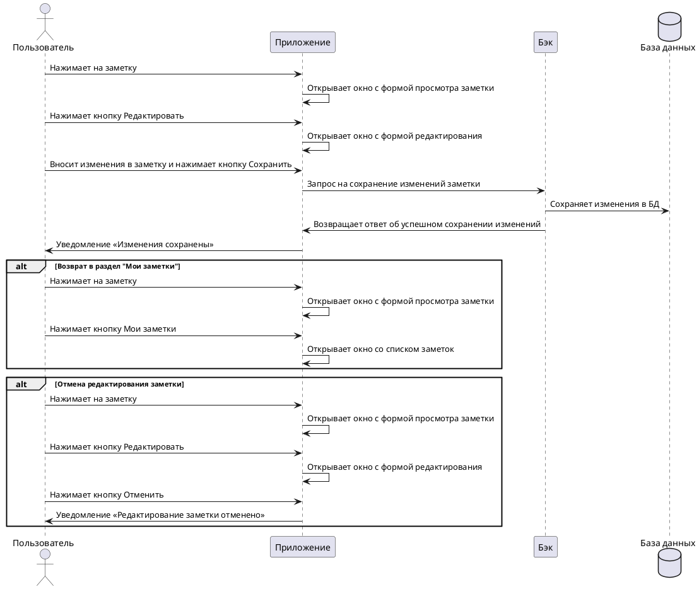

---
tags:
  - портфолио
---
# **Пользовательский сценарий «Редактирование заметки»**

## **Действующие лица**:
1. Пользователь
2. Приложение
3. Бэк
4. База данных

## **Предварительные условия**
Пользователь должен находиться на главном экране.

## **Выходные условия**
В системе была изменена заметка пользователя.

## **Основной сценарий**
1. Пользователь нажимает на заметку.
2. Приложение открывает окно с формой просмотра заметки.
3. Пользователь нажимает кнопку **Редактировать**.
4. Приложение открывает окно с формой редактирования.
5. Пользователь вносит изменения в заметку.
6. Пользователь нажимает кнопку **Сохранить**.
7. Приложение отправляет запрос Бэку на сохранение изменений заметки.
8. Бэк сохраняет изменения заметки в Базе данных.
9. Бэк возвращает Приложению ответ об успешном сохранении изменений заметки.
10. Приложение открывает пользователю уведомление «Изменения сохранены».

## **Альтернативный сценарий 1**
1. Пользователь нажимает на заметку.
2. Приложение открывает окно с формой просмотра заметки.
3. Пользователь нажимает кнопку **Мои заметки**.
4. Приложение открывает окно со списком заметок.

## **Альтернативный сценарий 2**
1. Пользователь нажимает на заметку.
2. Приложение открывает окно с формой просмотра заметки.
3. Пользователь нажимает кнопку **Редактировать**.
4. Приложение открывает окно с формой редактирования.
5. Пользователь нажимает кнопку **Отменить**.
6. Приложение открывает пользователю уведомление «Редактирование заметки отменено».

## **Диаграмма последовательности**




??? note "Код диаграммы"
        
    ```go
    @startuml
    actor Пользователь as user
    participant Приложение as client
    participant Бэк as back
    database "База данных" as bd

    user -> client: Нажимает на заметку
    client -> client: Открывает окно с формой просмотра заметки
    user -> client: Нажимает кнопку Редактировать
    client -> client: Открывает окно с формой редактирования
    user -> client: Вносит изменения в заметку и нажимает кнопку Сохранить
    client -> back: Запрос на сохранение изменений заметки
    back -> bd: Сохраняет изменения в БД
    back -> client: Возвращает ответ об успешном сохранении изменений
    client -> user: Уведомление «Изменения сохранены» 

    alt Возврат в раздел "Мои заметки"
    user -> client: Нажимает на заметку
    client -> client: Открывает окно с формой просмотра заметки
    user -> client: Нажимает кнопку Мои заметки
    client -> client: Открывает окно со списком заметок
    end alt

    alt Отмена редактирования заметки
    user -> client: Нажимает на заметку
    client -> client: Открывает окно с формой просмотра заметки
    user -> client: Нажимает кнопку Редактировать
    client -> client: Открывает окно с формой редактирования
    user -> client: Нажимает кнопку Отменить
    client -> user: Уведомление «Редактирование заметки отменено» 
    end alt
    @enduml
    ```
    